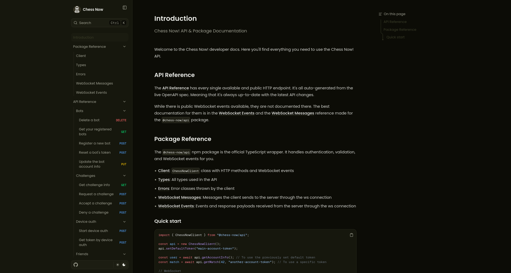
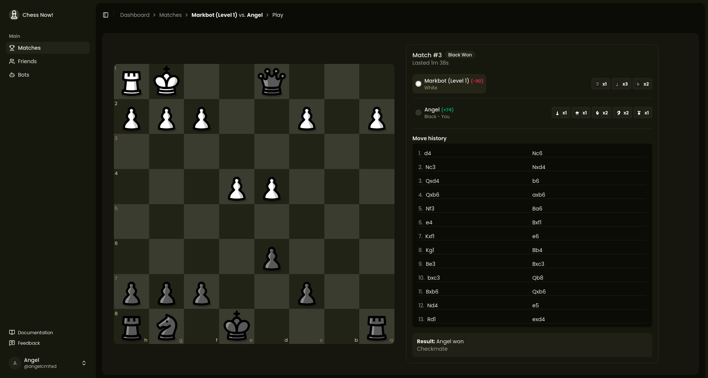
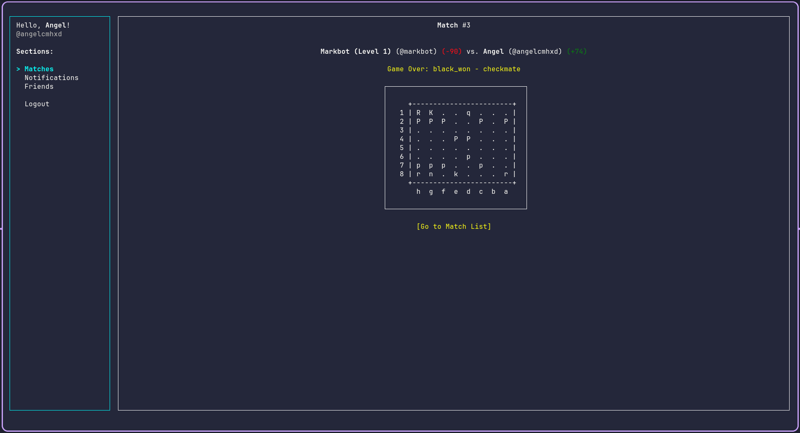
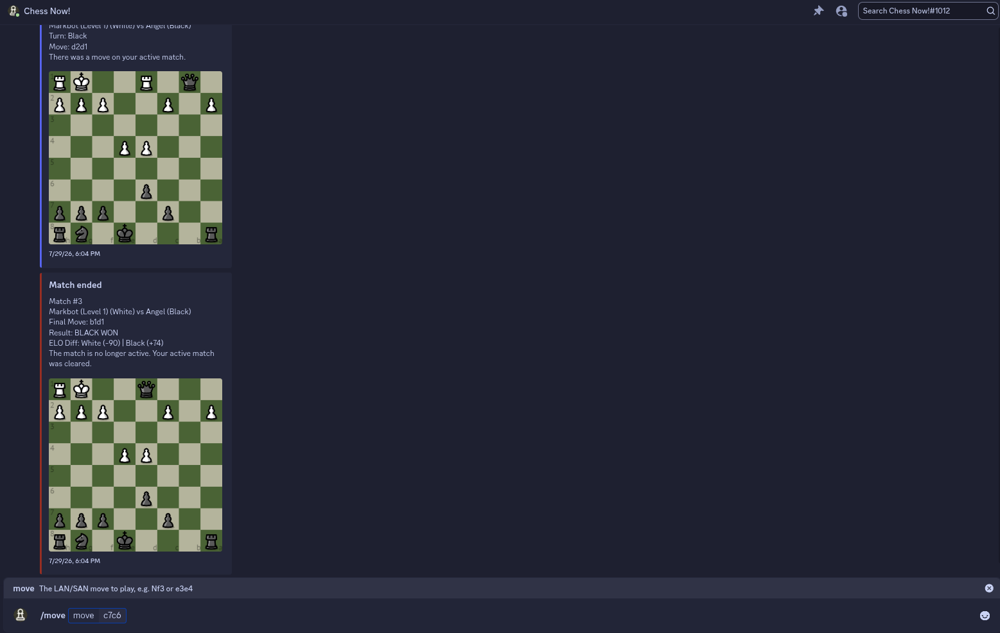

<div align="center">
  
</div>

<h1 align="center">Chess Now!</h1>

Real-time chess API with challenges, matches, and authentication.

## Stack

| Layer         | Tech                                                                                                                       |
| ------------- | -------------------------------------------------------------------------------------------------------------------------- |
| Frontend      | [Next.js](https://nextjs.org), [Tailwind CSS](https://tailwindcss.com), [shadcn/ui](https://ui.shadcn.com)                 |
| Backend       | [Elysia](https://elysiajs.com) with [Bun](https://bun.sh)                                                                  |
| Database      | [PostgreSQL](https://www.postgresql.org) with [Drizzle ORM](https://orm.drizzle.team). Redis or in-memory as secondary DB. |
| Auth          | [Better Auth](https://better-auth.com) (email/password, social, device)                                                    |
| Docs          | [Fumadocs](https://www.fumadocs.dev/) with OpenAPI and TypeScript integration                                              |
| Reverse Proxy | [Caddy](https://caddyserver.com) in prod, Next.js in dev (Look at `next.config.ts`)                                        |

## Getting Started

```bash
bun install
cp .env.template .env # remember to fill in environment variables
bun dev               # starts web + api concurrently
```

## Packages

This is a monorepo that contains other packages besides the main API.

| Package                                                          | Path                | Description                                    |
| ---------------------------------------------------------------- | ------------------- | ---------------------------------------------- |
| [`@chess-now/api`](https://www.npmjs.com/package/@chess-now/api) | `packages/api/`     | TypeScript client for the HTTP + WebSocket API |
| `@chess-now/bots`                                                | `packages/bots/`    | Bots you can play against                      |
| `@chess-now/discord`                                             | `packages/discord/` | Discord bot for the chess game                 |
| `@chess-now/tui`                                                 | `packages/tui/`     | TypeScript terminal UI client                  |

## AI Disclaimer

It was used mainly during the development of some packages. If the package was made with AI assistance, you can find the specific details in the package's README.md, if you can't find it there, it means that no AI was used.

It was also used to help with some CSS styling in the frontend, as I'm not really good with UI :/

None of the backend API was made with generative AI, which is the main focus of this project.

## Documentation

Visit the [docs](https://chessnow.angelcmh.com/docs) for the full API and package reference.

## Screenshots

### Docs



### Web Match



### Terminal UI



### Discord bot


